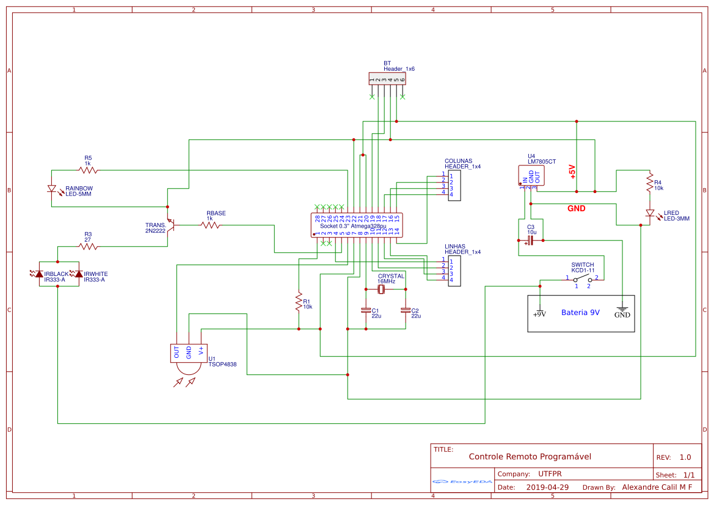
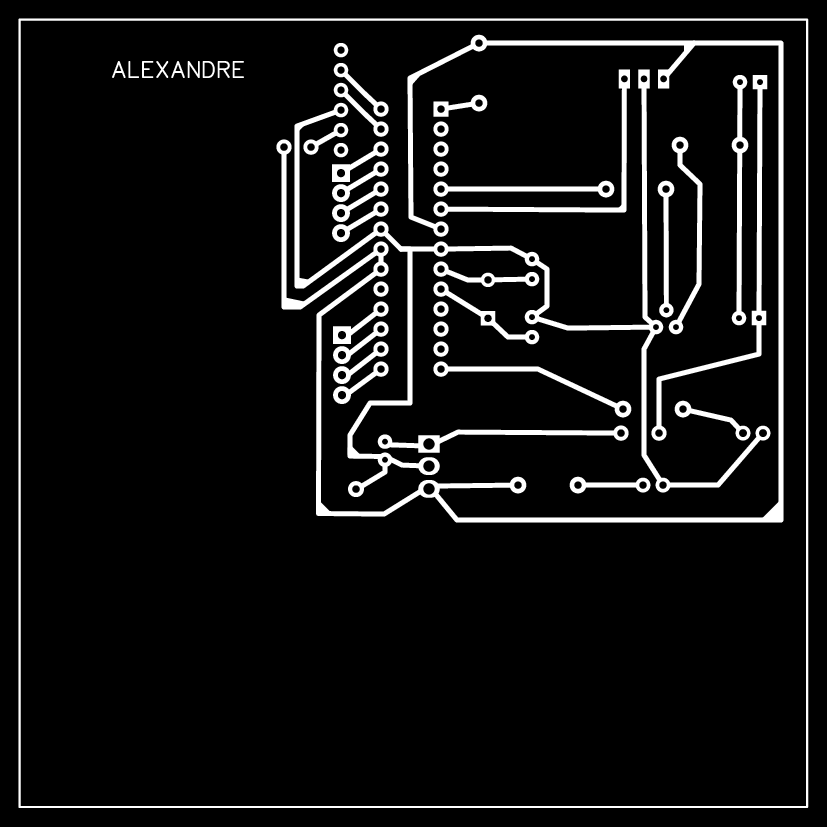
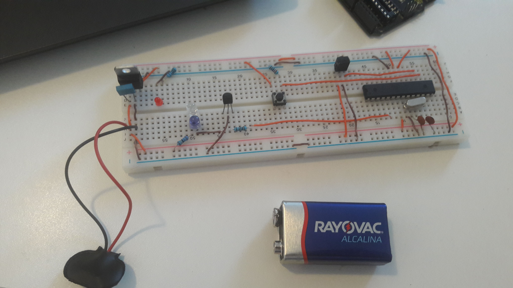

 

  <h3 align="center">Universal Controller</h3>

  

    A programmable IR controller that records and replays IR signals.
     
	 
    <a href="https://github.com/xandao6/universal-controller"><strong>Explore the docs »</strong></a>
     
    <a href="https://github.com/xandao6/universal-controller/issue">Report Bug</a>
    ·
    <a href="https://github.com/xandao6/universal-controller/issues">Request Feature</a>
  

<!-- TABLE OF CONTENTS -->

  
Table of Contents

  <ol>
    <li>
      <a href="#about-the-project">About The Project</a>
      <ul>
        <li><a href="#features">Features</a></li>
        <li><a href="#built-with">Built With</a></li>
      </ul>
    </li>
    <li><a href="#roadmap">Roadmap</a></li>
    <li><a href="#contributing">Contributing</a></li>
    <li><a href="#license">License</a></li>
    <li><a href="#contact">Contact</a></li>
  </ol>

<!-- ABOUT THE PROJECT -->
## About The Project

Universal Controller is a programmable IR controller, it uses HC-05 bluetooth module, standalone Arduino Mega, IR led transmitter and IR reciever TSOP4838. It can store code from other controllers and replay it. Bluetooth control is on the way.

  

### Features

* Read IR signals from other controllers
* Store IR signals
* Replay IR signals
* ~~Send IR signals via bluetooth~~ (WIP)

### Built With

* [Arduino](https://www.arduino.cc/) - Arduino Programming Language
* [HC-05](https://www.sparkfun.com/products/13975) - Bluetooth Module
* [ATmega328P](https://www.sparkfun.com/products/11021) - Arduino Uno IC
* [IR LED](https://www.sparkfun.com/products/9349) - IR LED Transmitter
* [TSOP4838](https://www.mouser.com/ProductDetail/Vishay-Semiconductors/TSOP4838) - IR Receiver

<!-- ROADMAP -->
## Roadmap

See the [open issues](https://github.com/xandao6/universal-controller/issues) for a list of proposed features (and known issues).

<!-- CONTRIBUTING -->
## Contributing

Contributions are what make the open source community such an amazing place to be learn, inspire, and create. Any contributions you make are **greatly appreciated**.

1. Fork the Project
2. Create your Feature Branch (`git checkout -b feature/AmazingFeature`)
3. Commit your Changes (`git commit -m 'Add some AmazingFeature'`)
4. Push to the Branch (`git push origin feature/AmazingFeature`)
5. Open a Pull Request

<!-- LICENSE -->
## License

Distributed under the MIT License. See [LICENSE](./LICENSE.md) for more information.

Free software =)

<!-- CONTACT -->
## Contact

Alexandre Calil - [@xandao6](https://www.linkedin.com/in/xandao6/) - alexandrecalilmf@gmail.com

Project Link: [https://github.com/xandao6/universal-controller](https://github.com/xandao6/universal-controller)